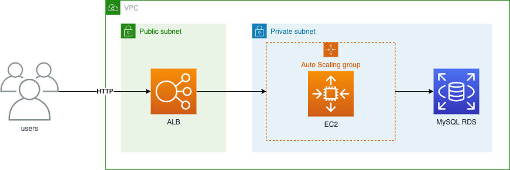

# wordpress-mysql-ec2

[](https://circleci.com/gh/ttangwork/wordpress-mysql-ec2)

IaC solution for wordpress and mysql running on ec2.  


## Prerequesites

The solution was created using Terraform 0.14.3 with HashiCorp AWS provider 3.22.0.  
In order to remove the AWS resources built by the pipeline, you need to have Terraform installed locally. The pipeline doesn't destroy resources however you can review the commented sections in `.circleci/config.yml` to restore steps for destroying the resources.  
Terraform state is stored in S3 backend which needs to be created manually. See more details about S3 backend below.

### AWS SSM parameters

The following SSM parameters are created by `rds_vars.sh` script therefore the Terraform state file doesn't contain the password.

* wp-db-user
* wp-db-password

### Terraform S3 backend

Run Terraform commands in `s3-backend` manually to create the backend bucket. Once the bucket is created, update the following files:

* terraform/network/backend.tf
* terraform/ec2/data.tf
* terraform/ec2/backend.tf
* terraform/rds/data.tf
* terraform/rds/backend.tf

## Run

Through CircleCI pipeline, a workflow of creating AWS resources:

1. Create network resources (VPC, Subnets, Gateways, Routing)
2. Create RDS resources (MySQL)
3. Packer build using the latest Amazon Linux 2
4. Create EC2 resources (ALB and ASG)

You will need to specify a keypair for your EC2 in its `environment.tfvars` file:

```sh
key_name = "ec2_instance1" # specify the EC2 keypair here
```

## Scheduled builds

You can schedule a job to regularly rebuild EC2 using the latest AMI and WordPress. This can be done by creating a branch named `feature/scheduled-packer-build` off `master` branch. The schedule can be set by updating the cron expression in `.cricleci/config.yml`:  

```sh
cron: "0 14 * * *"
````

CircleCI uses UTC for cron therefore the example above is 1:00 AM (Australian EST DST UTC+11:00).

## Destroy resources

The pipeline workflow doesn't include any steps to destroy the resources however you can find the workflow that contains destroy steps from the commented sections in `.cricleci/config.yml`. If you have Terraform installed and configured locally, you can run `scripts/destroy_all.sh` or run the following commands manually from `terraform/ec2`, `terraform/rds` and `terraform/network` folders:

```sh
terraform plan -destroy -out tfplan -var-file environment.tfvars
terraform apply -auto-approve tfplan
```

## ToDo

* Ansible review/rewrite
* CircelCI pipeline review/rewrite - maybe will move to BuildKite instead
* Integrating DynamoDB for state locking

## References

* <https://learn.hashicorp.com/tutorials/terraform/circle-ci>
* <https://github.com/terraform-google-modules/terraform-google-cloud-dns/issues/8>
* <https://www.packer.io/docs/builders/amazon-ebs.html>
* <https://github.com/hashicorp/packer/issues/7527>
* <https://circleci.com/docs/2.0/deployment-examples/#aws>
* <https://github.com/CircleCI-Public/circleci-packer>
* <https://registry.terraform.io/providers/hashicorp/aws/latest/docs>
